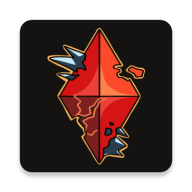

<p align="center">
  
</p>

<h1 align="center">SkyTimes</h1>

<p align="center">
  Event times, shard tracking, daily quests, reminders, and widgets for <em>Sky: Children of the Light</em>.
</p>

<p align="center">
  
  
  
  
  
</p>

## Overview

SkyTimes is a Kotlin Multiplatform app for players of *Sky: Children of the Light*. It brings commonly needed Sky timing information into one place: repeating in-game event schedules, shard information, current daily quest data, reminders, and quick access through an Android home screen widget.

The app is useful for players who want to plan candle runs, check reset-based activities, track shards by date, and receive reminder notifications before selected events.

## Features

### Sky Event Tracking

- Live countdowns for recurring and reset-based Sky events.
- Event detail sheets with upcoming occurrences and available infographic/location media.
- Pinning and manual reordering for preferred events.

### Shards

- Date-based shard tracking using shared domain calculations.
- Swipeable shard pages with countdown-focused views.

### Quests

- Daily quest, rotating candle, and seasonal candle display.
- Pull-to-refresh support.

### Vault Archive
- In-development

### Reminders and Notifications

- Per-event reminders with configurable offset up to 15 minutes before an event.
- Notification toggle in settings.
- Web currently uses a no-op reminder scheduler.

### Android Widget

- Glance-based Android app widget for in-game event countdowns.
- Widget configuration activity.

### Customization

- Light, dark, and system theme modes.
- Custom theme color and contrast controls.
- Optional clock digit animation.
- 12-hour or 24-hour time display.
- Configurable default home tab.

## Screenshots

Screenshots or demo GIFs can be added here when available.

```md


```

## Supported Platforms

| Platform | Status | Notes |
| --- | --- | --- |
| Android | Supported | Native Android app, APK release artifact, Android 13+ (`minSdk 33`). |
| iOS / iPadOS | Supported via manual install | IPA release artifact is unsigned and must be sideloaded. |
| Web | Supported build target | Kotlin/Wasm browser build; release workflow deploys the web build to Cloudflare Pages. |

## Installation

### Android

1. Open the latest release: <https://github.com/imnaiyar/SkyTimes/releases/latest>
2. Download the Android APK, usually named `skytimes-android-<version>.apk`.
3. Install the APK on your Android device.
4. Grant notification permissions if you want event reminders.

> [!NOTE]
> Android may ask you to allow installation from the browser or file manager used to open the APK.

### iOS / iPadOS

> [!WARNING]
> The iOS/iPadOS release is distributed as an unsigned IPA and must be sideloaded using a compatible installation tool, such as Plume Impactor. It cannot be installed directly like a normally App Store-signed application.

The sideloading workflow depends on the tool and signing method you choose. You may need to use your own Apple ID or signing setup depending on the tool. Certificate, signing, and installation limitations are controlled by Apple account policies and the sideloading tool being used.

This project is not affiliated with, endorsed by, or responsible for third-party sideloading tools.

General IPA installation flow:

1. Download the IPA release from <https://github.com/imnaiyar/SkyTimes/releases/latest>.
2. Install or open a compatible sideloading tool, such as Plume Impactor.
3. Connect or select the target iPhone or iPad as required by the tool.
4. Select the downloaded IPA.
5. Follow the sideloading tool's signing and installation instructions.
6. Launch SkyTimes after installation.

### Web

Web app: https://skytimes-dev.skyhelper.xyz


## Downloads

Download the latest release from:

<https://github.com/imnaiyar/SkyTimes/releases/latest>

Release artifacts currently produced by the workflow:

- Android APK: `skytimes-android-<version>.apk`
- iOS/iPadOS IPA: `skytimes-ios-<version>.ipa`
- Web build: built and deployed by CI to Cloudflare Pages when the web release job runs

## Contributing

Contributions are welcome. Please read the [Contributing Guide](CONTRIBUTING.md) before opening an issue or pull request.

## License

No license file is currently included in this repository. Add a `LICENSE` file and update this section before distributing or accepting external contributions.

## Disclaimer

SkyTimes is an independent companion app for *Sky: Children of the Light*. It is not affiliated with, endorsed by, or sponsored by thatgamecompany. Event and quest data may change with game updates, so verify important in-game plans against the current game state when needed.
